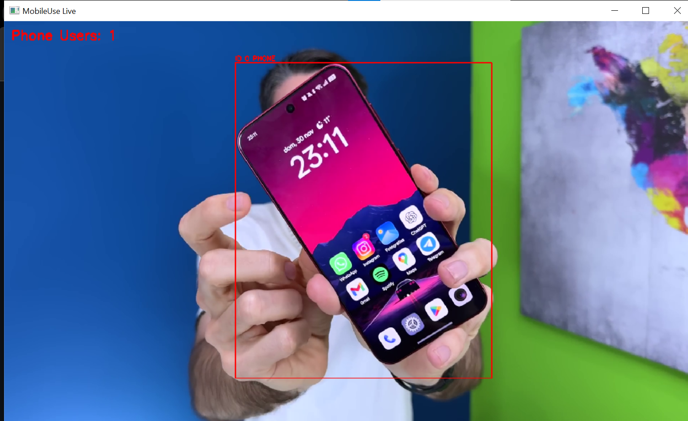

# Mobile Usage YOLOv8
Este proyecto permite **detectar personas usando el móvil** en vídeo o cámara en tiempo real, y contar el número de **personas únicas**.

---

Para ejecutar el proyecto:
```bash
python yolo.py
```

Output de ejemplo:

